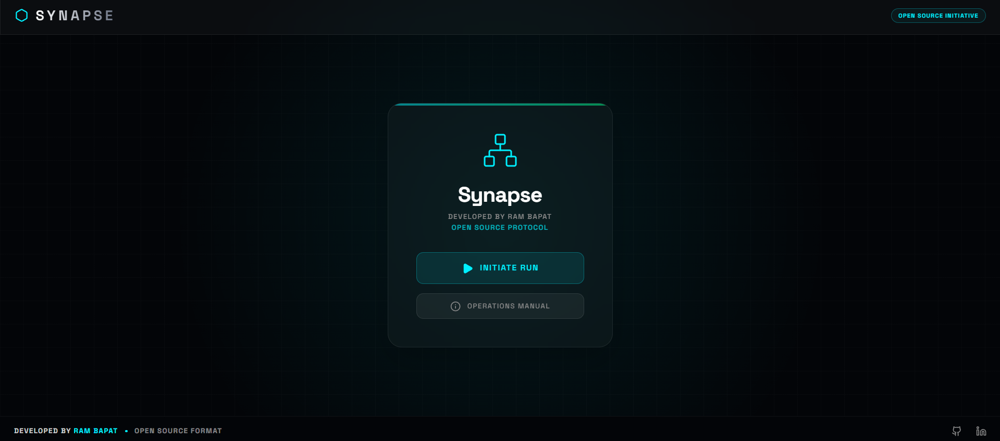
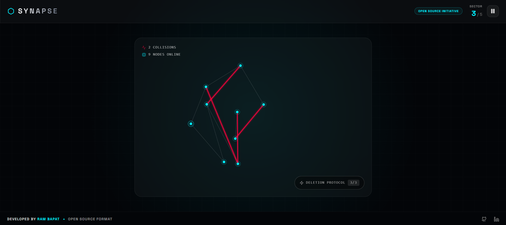
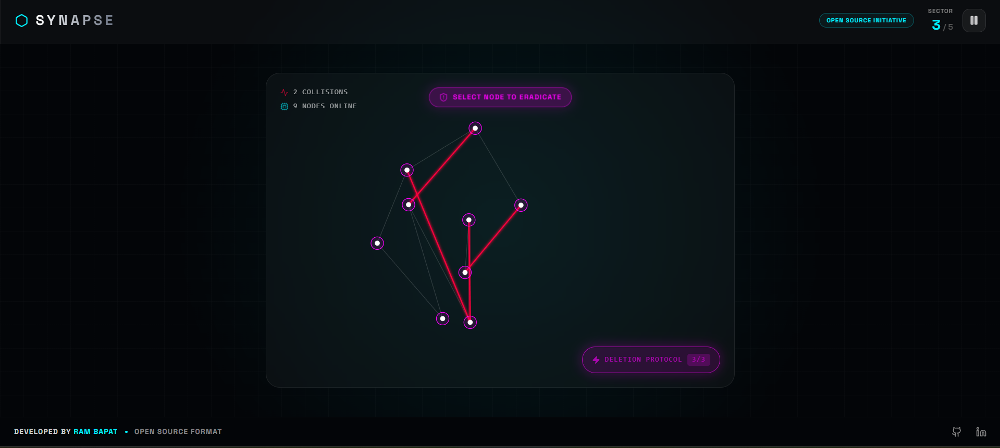

# 💧 AquaFlow

    

**Day 23 / 30 - April Vibe Coding Challenge**

## 🔗 [Live Demo](https://AquaFlow-Water-Game.vercel.app/)

**AquaFlow** is a premium HTML5 Canvas fluid simulation puzzle. The player is tasked with dropping precisely 100 liters (100 particles) of liquid through a mathematically robust physics environment filled with deflection lines, funnels, and gravity. 

Capture at least **60L** in the container to successfully secure the sector.

## 📸 Screenshots








## ✨ Features

*   **🌊 Canvas Particle Physics:** Fully custom-built 60fps physics logic entirely inside React rendering thousands of particle collision checks using line segment deflection math.
*   **🧩 Viscosity Logic:** Mathematical particle grouping forces liquid dots to slightly clump naturally imitating actual fluid tension. 
*   **📱 Universal Scaling:** High-Resolution canvas scales perfectly to standard viewports without distorting the strict mathematical coordinate boundaries.
*   **💎 Clean Vibe Aesthetic:** Constructed with absolute minimalism in mind (`#F8FAFC`, `#0CA5E9`) avoiding heavy, clunky textures for a hyper-premium "Apple" style app feeling. 
*   **🤍 Open Source Ready:** Hand-crafted and strictly defined under an Open Source Protocol by creator Ram Bapat. 

## 🛠 Tech Stack

*   **Framework:** React 19 + TypeScript
*   **Canvas Interface:** HTML5 Canvas Context 2D
*   **Build Tool:** Vite
*   **Styling & UI:** Tailwind CSS v4 
*   **Animations:** Framer Motion (`motion/react`)
*   **Icons:** Lucide React

## 🚀 Getting Started

If you want to run this simulation locally:

1.  **Clone the repository**
    ```bash
    git clone https://github.com/Barrsum/AquaFlow-Water-Game.git
    cd AquaFlow-Water-Game
    ```
2.  **Install dependencies:**
    ```bash
    npm install
    ```
3.  **Start the development server:**
    ```bash
    npm run dev
    ```
4.  Open the provided localhost URL in your browser.

## 👨‍💻 Author

**Ram Bapat**

*   🌍 [GitHub](https://github.com/Barrsum)
*   💼 [LinkedIn](https://www.linkedin.com/in/ram-bapat-barrsum-diamos)

---
*Created carefully as a part of the 30 Days of Vibe Coding challenge.*
